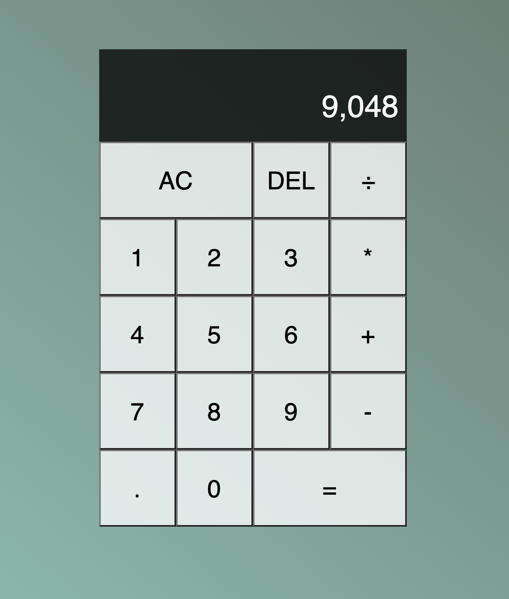

# Javascript-Calculator

## Technologies used: HTML, CSS, & JavaScript

## Summary: 

Developed a simple Calculator using HTML, CSS, and JavaScript. The app is able to calculate most of your math problems.

# Instructions: 
Download code and run a live server of the index.html. You'll be able to utilize this right away.

